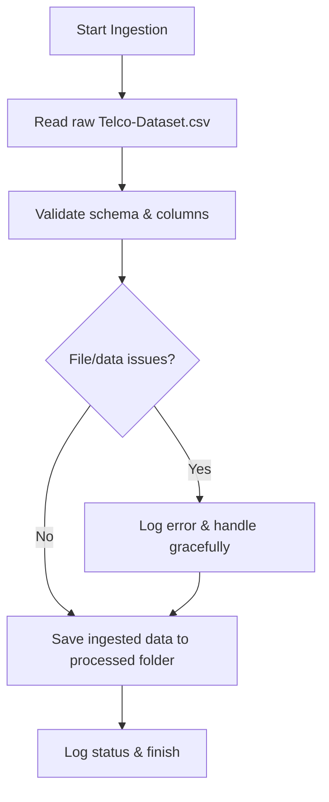

# Data Ingestion Stage – Detailed Documentation

This document describes the purpose, workflow, and implementation details of the `ingestion.py` script in the Customer Churn Prediction Pipeline. A Mermaid flowchart is included to visualize the data flow within this stage.

---

## Purpose

The `ingestion.py` script is responsible for loading raw data from the source (such as `data/raw/Telco-Dataset.csv`) into the pipeline. It ensures that the data is available in a standardized format for all downstream processing steps.

---

## Workflow Steps

1. **Read Raw Data:**  
   - Loads the Telco customer dataset from the specified CSV file.
   - Checks if the file exists and is accessible.

2. **Initial Data Inspection:**  
   - Performs basic schema validation (e.g., checks for required columns).
   - Logs the number of records and columns loaded.

3. **Handle Data Issues:**  
   - Handles missing or corrupted files gracefully, logging any issues.
   - Optionally, performs basic cleaning (e.g., removing empty rows).

4. **Save Ingested Data:**  
   - Writes the ingested data to a standardized location (e.g., `data/processed/ingested_data.csv`) for use in subsequent pipeline stages.

5. **Logging:**  
   - Logs the status and any issues encountered during ingestion for traceability.

---

## Mermaid Flowchart



---

## Inputs

- `data/raw/Telco-Dataset.csv` (or other raw data sources)

## Outputs

- Ingested data file (e.g., `data/processed/ingested_data.csv`)
- Ingestion logs

---

## Notes

- The script is designed to be robust against missing or malformed files.
- Ensures all downstream pipeline steps use the same, standardized data input.
- Logging is critical for monitoring and debugging the ingestion process.

---

## Example Usage

```bash
python src/ingestion.py
```

---

This ingestion stage is foundational for the pipeline, ensuring reliable and consistent data flow into all subsequent processing and modeling steps.