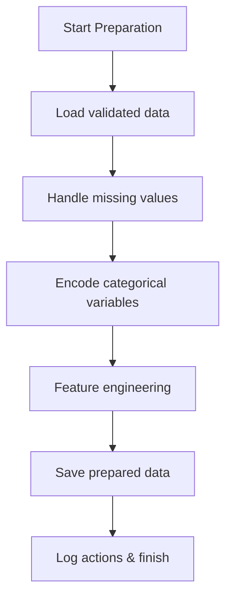

# Data Preparation Stage – Detailed Documentation

This document describes the purpose, workflow, and implementation details of the `preparation.py` script in the Customer Churn Prediction Pipeline. A Mermaid flowchart is included to visualize the data preparation process.

---

## Purpose

The `preparation.py` script prepares the validated data for machine learning by handling missing values, encoding categorical variables, and performing feature engineering. This step ensures that the data is in a suitable format for modeling and can significantly impact model performance.

---

## Workflow Steps

1. **Load Validated Data:**  
   - Reads the validated data file (e.g., `data/processed/ingested_data.csv` or `data/processed/validated_data.csv`).

2. **Handle Missing Values:**  
   - Imputes missing values using appropriate strategies (mean, median, mode, or custom logic).
   - Optionally removes rows or columns with excessive missing data.

3. **Encode Categorical Variables:**  
   - Converts categorical columns into numerical format using techniques such as one-hot encoding or label encoding.
   - Ensures all categorical features are properly represented for modeling.

4. **Feature Engineering:**  
   - Creates new features based on domain knowledge (e.g., tenure groups, interaction terms).
   - Transforms or combines existing features to enhance predictive power.

5. **Save Prepared Data:**  
   - Writes the prepared data to a new file (e.g., `data/processed/prepared_data.csv`) for use in subsequent pipeline stages.

6. **Logging:**  
   - Logs all actions taken, including imputation strategies, encoding methods, and new features created.

---

## Mermaid Flowchart



---

## Inputs

- Validated data file (e.g., `data/processed/ingested_data.csv` or `data/processed/validated_data.csv`)

## Outputs

- Prepared data file (e.g., `data/processed/prepared_data.csv`)
- Preparation logs

---

## Notes

- The script is flexible to accommodate different imputation and encoding strategies.
- Feature engineering is a key step for improving model accuracy.
- All transformations are logged for reproducibility and transparency.

---

## Example Usage

```bash
python src/preparation.py
```

---

This preparation stage is crucial for transforming raw validated data into a format that maximizes the effectiveness of machine learning models.