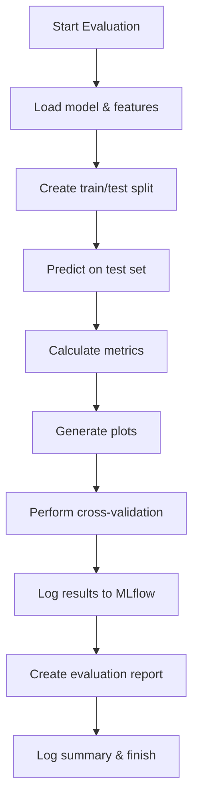

# Model Evaluation Stage – Detailed Documentation

This document explains the purpose, workflow, and implementation details of the `model_evaluation.py` script in the Customer Churn Prediction Pipeline.

---

## Purpose

The `model_evaluation.py` script is responsible for thoroughly evaluating the trained churn prediction model. It loads the model and test data, computes a wide range of performance metrics, generates visualizations, performs cross-validation, logs results to MLflow, and creates a comprehensive evaluation report.

---

## Workflow Steps

1. **Logging Setup**
   - Initializes logging to both a file (`logs/evaluation.log`) and the console for traceability.

2. **Configuration**
   - Sets up paths for the model, evaluation outputs, and MLflow tracking.

3. **Load Model and Data**
   - Loads the trained model (`models/churn_model.pkl`) using `joblib`.
   - Loads features and target variable using the `get_features_for_training` function from `load_features.py`.

4. **Train/Test Split**
   - Recreates the same stratified train/test split as used during training.
   - Handles class imbalance by upsampling the minority class if needed.

5. **Model Prediction**
   - Uses the loaded model to predict churn on the test set.
   - Obtains both class predictions and predicted probabilities.

6. **Metric Calculation**
   - Computes a comprehensive set of metrics:
     - Accuracy, Precision, Recall, F1-score
     - ROC-AUC, Average Precision
     - Confusion matrix and derived metrics (specificity, sensitivity, TP, TN, FP, FN)

7. **Visualization**
   - Generates and saves the following plots:
     - Confusion Matrix (heatmap)
     - ROC Curve
     - Precision-Recall Curve
     - Feature Importance (for tree-based or linear models)

8. **Cross-Validation**
   - Performs 5-fold stratified cross-validation on the entire dataset.
   - Computes mean and standard deviation for accuracy, precision, recall, F1, and ROC-AUC.

9. **MLflow Logging**
   - Logs evaluation metrics, cross-validation results, and plots as artifacts to MLflow, using the best run ID from training.

10. **Evaluation Report**
    - Creates a detailed Markdown report summarizing all metrics, cross-validation results, and visualizations.
    - Saves the report to the `evaluation/` directory.

11. **Final Logging**
    - Logs all key results and the location of the evaluation report.

---

## Mermaid Flowchart



---

## Inputs

- Trained model file: `models/churn_model.pkl`
- Feature data: loaded via `get_features_for_training()` from the feature store/database

## Outputs

- Evaluation metrics (accuracy, precision, recall, F1, ROC-AUC, etc.)
- Plots: confusion matrix, ROC curve, precision-recall curve, feature importance
- Cross-validation statistics
- MLflow experiment logs and artifacts
- Evaluation report: `evaluation/evaluation_report.md`
- Evaluation logs: `logs/evaluation.log`

---

## Key Implementation Details

- **Robustness:** Handles missing files, class imbalance, and single-class edge cases gracefully.
- **Comprehensive Metrics:** Goes beyond basic metrics to include specificity, sensitivity, and average precision.
- **Visualization:** Automatically generates and saves all key diagnostic plots.
- **MLflow Integration:** All results and artifacts are logged for experiment tracking and reproducibility.
- **Reporting:** Produces a Markdown report summarizing all findings for business and technical stakeholders.

---

## Example Usage

```bash
python src/model_evaluation.py
```

---

## Notes

- The script is modular and can be extended to include additional metrics or plots as needed.
- All steps are logged for transparency and debugging.
- The evaluation report provides actionable insights for both data scientists and business users.

---

This evaluation stage ensures that the churn prediction model is thoroughly assessed, documented, and ready for deployment or further improvement.