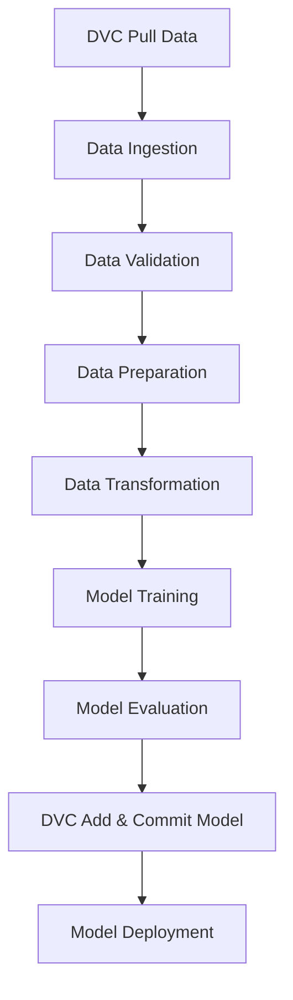

# Pipeline Overview

This document provides a high-level overview of the Customer Churn Prediction Pipeline, describing each stage, its purpose, and the overall data flow.

---

## Pipeline Stages

1. **DVC Data Pull**  
   Ensures all required data and model artifacts are available by pulling them from remote storage using DVC.

2. **Data Ingestion**  
   Loads raw data (e.g., `Telco-Dataset.csv`) into the pipeline and saves it in a standardized format for downstream processing.

3. **Data Validation**  
   Checks the ingested data for missing values, duplicates, invalid types, and out-of-range values to ensure data quality.

4. **Data Preparation**  
   Handles missing values, encodes categorical variables, and performs feature engineering to prepare data for modeling.

5. **Data Transformation**  
   Applies scaling, normalization, and optional dimensionality reduction to optimize features for machine learning algorithms.

6. **Model Training**  
   Trains machine learning models (e.g., logistic regression, random forest) to predict customer churn, evaluates them, and saves the best model.

7. **Model Evaluation**  
   Assesses the trained model’s performance using metrics such as accuracy, precision, recall, F1-score, and ROC-AUC, and generates evaluation reports and plots.

8. **DVC Add & Commit Model**  
   Tracks the trained model with DVC and commits changes to Git for versioning and reproducibility.

9. **Model Deployment**  
   Deploys the evaluated and versioned model to a production or staging environment for inference, and generates supporting scripts and documentation.

---

## Pipeline Flowchart

---

## Summary

This pipeline ensures a robust, reproducible, and automated workflow for customer churn prediction, from raw data ingestion to model deployment. Each stage is modular, allowing for easy debugging, maintenance, and future enhancements.